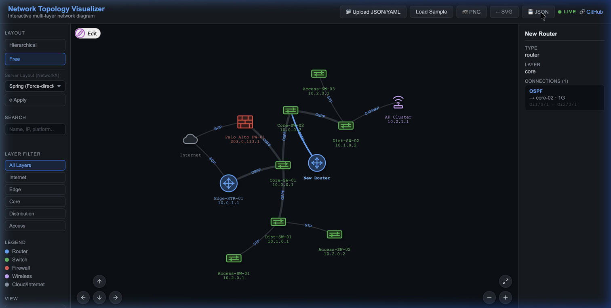
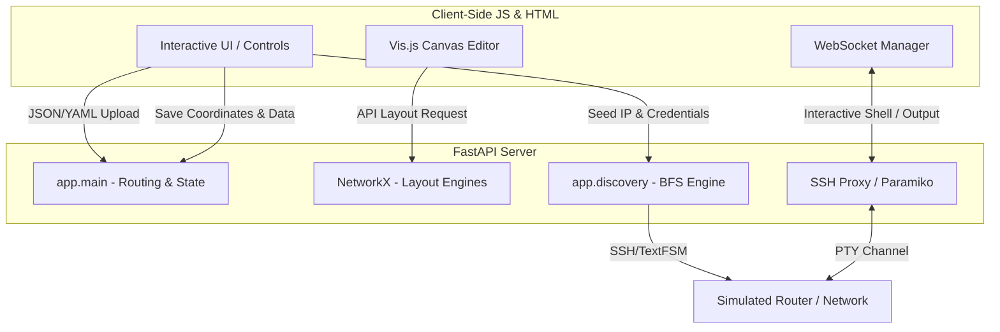

# Network Topology Visualizer

Upload a network inventory (JSON or YAML) or build one from scratch using the Interactive GUI Editor. Get an interactive, zoomable topology diagram featuring custom dark-mode SVG device icons and multi-layer filtering.



## Features

- **Interactive GUI Builder** — Build network diagrams dynamically without writing JSON! Drag and drop nodes, draw connections, and configure device node properties (IP, Layer, Type) through sleek popup modals.
- **Custom Device Icons** — Premium, dark-mode native SVG icons for Routers, Switches, Firewalls, Wireless APs, and Cloud environments.
- **Server-Side Layouts** — Leverage Python's `networkx` backend to arrange topologies using advanced algorithms (Spring, Kamada-Kawai, Circular, Shell, Spectral).
- **Server-Side State Persistence** — Save your visual coordinates, new nodes, and custom links directly to the server with the **Save to Server** feature to keep layout configurations on page refreshes.
- **Interactive Canvas** — Drag nodes, zoom, pan; click a device or link to see its configuration details in the side panel.
- **Export Capabilities** — Save your visual diagram as **PNG** or **SVG**, or export your custom-drawn network back to a **JSON** file to use in automation workflows.
- **Live Search & Layer Filtering** — Quickly find specific devices by IP/Name, and toggle between Core, Distribution, Access, and Edge views.
- **Dual-Mode Console Shell** — Switch between a stateful Mock router CLI shell or a real Netmiko SSH proxy console connection (with active PTY resize, command history, and canvas path tracing).

## System Architecture

The following diagram illustrates how the frontend visualizer, WebSocket server, and SSH network discovery components interact:



## Tech Stack

- Python 3.10+ / FastAPI — backend API, WebSocket proxy, & server-side layout calculations
- NetworkX, NumPy & SciPy — server-side graph layout mathematical positioning
- Vis.js Network — interactive graph rendering and GUI builder module
- Netmiko & Paramiko — SSH console sessions and queue-based neighbor discovery
- HTML/CSS/JavaScript — vanilla frontend featuring a premium dark mode aesthetic

## Inventory Format

```json
{
  "devices": [
    {
      "id": "core-sw-01",
      "label": "Core Switch 1",
      "type": "switch",
      "layer": "core",
      "ip": "10.0.0.1",
      "platform": "Cisco Catalyst 6509"
    },
    {
      "id": "dist-sw-01",
      "label": "Dist Switch 1",
      "type": "switch",
      "layer": "distribution",
      "ip": "10.0.1.1",
      "platform": "Cisco Catalyst 4507"
    }
  ],
  "links": [
    {
      "source": "core-sw-01",
      "target": "dist-sw-01",
      "protocol": "OSPF",
      "source_interface": "Gi1/0/1",
      "target_interface": "Gi1/0/24",
      "bandwidth": "10G"
    }
  ]
}
```

## Pathfinding & Highlight Logic

When there are multiple physical paths between a source and target device across the network:
- **Graph-Theoretic Pathfinding**: For pings, the visualizer canvas uses an unweighted **Breadth-First Search (BFS)** algorithm to compute paths.
- **Shortest Hop Priority**: The path with the fewest number of hops will always be selected and highlighted (pings in cyan).
- **Tie-Breaker**: If multiple redundant paths of equal hop length exist, the path whose connections are listed first in the active topology JSON dataset is chosen.
- **Real-Time Traceroute Pathfinding**: When performing a `traceroute` or `trace` command in the terminal console, the frontend parses the raw terminal stdout in real-time. Hop IP addresses are matched against the topology devices, and the visual canvas dynamically lights up the true routing path device-by-device (in orange) as the trace outputs print, overriding the default client-side BFS calculation.

## Quick Start

```bash
make setup
make run
# Open http://localhost:8000
# Upload your inventory JSON, use the sample topology, or draw your own!
```
